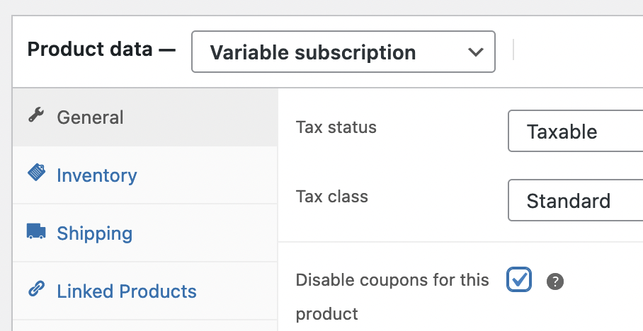
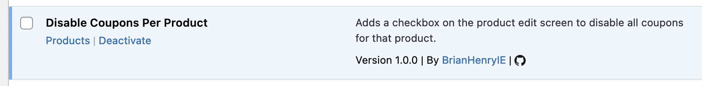

  
# Disable Coupons Per Product

WooCommerce plugin which adds a checkbox on each product which will prevent coupons applying to that product. Any coupon a customer uses will still apply to all other items in the cart.

The code is a slightly modified version of a StackOverflow answer to [Exclude product from all coupons in WooCommerce](https://stackoverflow.com/questions/47598528/exclude-product-from-all-coupons-in-woocommerce).

If the plugin [Search by ID](https://wordpress.org/plugins/search-by-id/) has been installed, the "Products" link on plugins.php will link to the list of products that have the setting enabled.

Download from [GitHub releases](https://github.com/BrianHenryIE/bh-wc-disable-coupons-per-product/releases).

### More Information

See [github.com/BrianHenryIE/WordPress-Plugin-Boilerplate](https://github.com/BrianHenryIE/WordPress-Plugin-Boilerplate) for initial setup rationale. 

# Acknowledgements

* [Disable using all coupuns for gift card product](https://wordpress.org/support/topic/disable-using-all-coupuns-for-gift-card-product/)
* [Disabling coupons on Subscriptions](https://wordpress.org/support/topic/disabling-coupons-on-subscriptions/)
* [Exclude Product From All Coupons](https://wordpress.org/support/topic/exclude-product-from-all-coupons/)